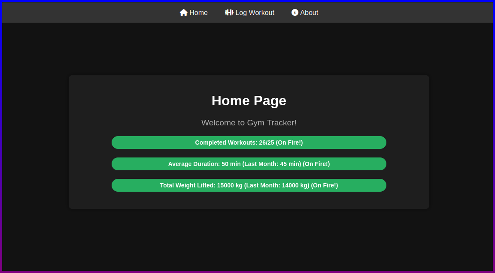

# GymTracker
A WIP flask app that allows you to track progress in the gym!

## Usage
```
git clone https://github.com/DatCodeMania/GymTracker.git
cd GymTracker
python3 -m venv venv
source venv/bin/activate
pip install -r requirements.txt
python3 main.py
```

## Example

